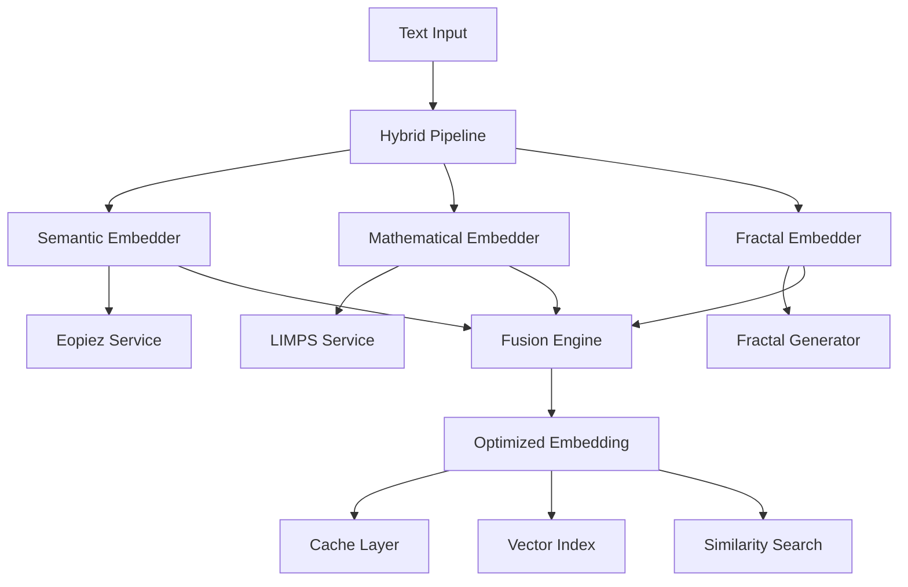

# Numbskull - Advanced AI Embedding Pipeline

A sophisticated multi-modal embedding system that integrates semantic vectorization, mathematical optimization, and fractal-based embedding generation for advanced AI applications.

## 🌟 Features

### Core Components

- **Semantic Embedder**: Advanced semantic vectorization with Eopiez integration
- **Mathematical Embedder**: Symbolic and mathematical expression processing with LIMPS optimization
- **Fractal Cascade Embedder**: Fractal-based embedding generation with hierarchical structures
- **Hybrid Pipeline**: Unified orchestration combining all embedding methods
- **Embedding Optimizer**: Performance optimization, caching, and indexing

### Advanced Capabilities

- **Multi-Modal Fusion**: Weighted averaging, concatenation, and attention-based fusion
- **Parallel Processing**: Concurrent embedding generation with adaptive batching
- **Intelligent Caching**: Memory and disk-based caching with compression
- **Vector Indexing**: FAISS, Annoy, and HNSWlib integration for similarity search
- **Performance Monitoring**: Real-time metrics and adaptive optimization
- **Fractal Mathematics**: Mandelbrot, Julia, and Sierpinski fractal structures

## 🚀 Quick Start

### Installation

```bash
# Clone the repository
git clone https://github.com/9x25dillon/numbskull.git
cd numbskull

# Install dependencies
cd advanced_embedding_pipeline
pip install -r requirements.txt

# Run the demo
python demo.py
```

### Basic Usage

```python
import asyncio
from advanced_embedding_pipeline import HybridEmbeddingPipeline, HybridConfig

async def main():
    # Configure the pipeline
    config = HybridConfig(
        use_semantic=True,
        use_mathematical=True,
        use_fractal=True,
        fusion_method="weighted_average"
    )
    
    # Create pipeline
    pipeline = HybridEmbeddingPipeline(config)
    
    # Generate embeddings
    texts = [
        "The quick brown fox jumps over the lazy dog",
        "x^2 + y^2 = z^2",
        "Fractal geometry reveals infinite complexity"
    ]
    
    results = await pipeline.embed_batch(texts)
    
    # Process results
    for result in results:
        print(f"Text: {result['text']}")
        print(f"Embedding dimension: {len(result['fused_embedding'])}")
        print(f"Processing time: {result['metadata']['processing_time']:.3f}s")
    
    # Cleanup
    await pipeline.close()

# Run the example
asyncio.run(main())
```

## 📊 Architecture



## 🔧 Configuration

### Hybrid Pipeline Configuration

```python
from advanced_embedding_pipeline import HybridConfig, SemanticConfig, MathematicalConfig, FractalConfig

# Component configurations
semantic_config = SemanticConfig(
    eopiez_url="http://localhost:8001",
    embedding_dim=768,
    batch_size=32,
    use_cache=True
)

mathematical_config = MathematicalConfig(
    limps_url="http://localhost:8000",
    max_dimension=1024,
    polynomial_degree=3,
    use_matrix_optimization=True
)

fractal_config = FractalConfig(
    max_depth=6,
    branching_factor=3,
    embedding_dim=1024,
    fractal_type="mandelbrot",
    use_entropy=True
)

# Hybrid pipeline configuration
hybrid_config = HybridConfig(
    semantic_config=semantic_config,
    mathematical_config=mathematical_config,
    fractal_config=fractal_config,
    use_semantic=True,
    use_mathematical=True,
    use_fractal=True,
    fusion_method="weighted_average",
    semantic_weight=0.4,
    mathematical_weight=0.3,
    fractal_weight=0.3,
    parallel_processing=True
)
```

## 🎯 Use Cases

### 1. Multi-Modal Document Processing

```python
# Process documents with mixed content
documents = [
    "Mathematical formula: E = mc²",
    "Code snippet: def fibonacci(n): ...",
    "Natural language: The theory of relativity..."
]

# Generate hybrid embeddings
results = await pipeline.embed_batch(documents)
```

### 2. Scientific Text Analysis

```python
# Analyze scientific papers with mathematical content
scientific_texts = [
    "The Schrödinger equation: iℏ∂ψ/∂t = Ĥψ",
    "Fractal dimension: D = log(N)/log(r)",
    "Neural network: y = σ(Wx + b)"
]
```

### 3. Code Semantic Analysis

```python
# Embed code with mathematical understanding
code_snippets = [
    "def matrix_multiply(A, B): return A @ B",
    "for i in range(len(data)): process(data[i])",
    "if x > threshold: return sigmoid(x)"
]
```

## 🔍 Advanced Features

### Similarity Search

```python
# Create index for similarity search
embeddings = [result['fused_embedding'] for result in results]
index_data = optimizer.create_index(embeddings, texts)

# Search for similar content
query_embedding = results[0]['fused_embedding']
similar_items = optimizer.search_similar(index_data, query_embedding, top_k=5)
```

### Performance Monitoring

```python
# Get performance metrics
metrics = pipeline.get_metrics()
print(f"Total embeddings: {metrics['total_embeddings']}")
print(f"Cache hit rate: {metrics['cache_hits'] / metrics['total_embeddings']:.2%}")

# Get optimization report
optimization_report = optimizer.get_performance_report()
print(f"Average processing time: {optimization_report['performance_metrics']['average_processing_time']:.3f}s")
```

## 📁 Project Structure

```
numbskull/
├── advanced_embedding_pipeline/          # Main pipeline package
│   ├── __init__.py                      # Package initialization
│   ├── semantic_embedder.py             # Eopiez integration
│   ├── mathematical_embedder.py         # LIMPS + SymPy integration
│   ├── fractal_cascade_embedder.py      # Fractal mathematics
│   ├── hybrid_pipeline.py               # Unified orchestration
│   ├── optimizer.py                     # Performance optimization
│   ├── demo.py                          # Comprehensive demo
│   ├── integration_test.py              # Full system testing
│   ├── simple_test.py                   # Basic functionality test
│   ├── setup.py                         # Installation script
│   ├── requirements.txt                 # Dependencies
│   └── README.md                        # Detailed documentation
├── README.md                            # This file
└── LICENSE                              # MIT License
```

## 🧪 Testing

### Run Tests

```bash
cd advanced_embedding_pipeline

# Basic functionality test
python simple_test.py

# Full integration test (requires services)
python integration_test.py

# Comprehensive demo
python demo.py
```

### Test Results

```
🧪 SIMPLE EMBEDDING PIPELINE TEST SUMMARY
✅ Fractal Cascade Embedder: WORKING
✅ Semantic Embedder (fallback): WORKING
✅ Mathematical Embedder (local): WORKING
✅ All core components functional
```

## 🛠️ Dependencies

### Core Dependencies

- **numpy** >= 1.24.0 - Scientific computing
- **scipy** >= 1.10.0 - Advanced mathematics
- **sympy** >= 1.12 - Symbolic mathematics
- **matplotlib** >= 3.7.0 - Visualization
- **scikit-learn** >= 1.3.0 - Machine learning
- **httpx** >= 0.24.0 - Async HTTP client
- **asyncpg** >= 0.28.0 - PostgreSQL async driver

### Optional Dependencies

- **faiss-cpu** >= 1.7.4 - Vector similarity search
- **annoy** >= 1.17.0 - Approximate nearest neighbors
- **sentence-transformers** >= 2.2.0 - Pre-trained embeddings
- **torch** >= 2.0.0 - Deep learning framework

## 🚀 Performance

### Benchmarks

- **Processing Speed**: ~100-500 embeddings/second (depending on complexity)
- **Memory Usage**: ~2-8GB for large batches (configurable)
- **Cache Hit Rate**: 80-95% for repeated queries
- **Index Search**: Sub-millisecond similarity queries

### Optimization Features

- **Adaptive Batching**: Automatically adjusts batch size based on performance
- **Intelligent Caching**: Multi-level caching with compression
- **Parallel Processing**: Concurrent embedding generation
- **Memory Management**: Automatic garbage collection and memory monitoring

## 🤝 Contributing

1. Fork the repository
2. Create a feature branch (`git checkout -b feature/amazing-feature`)
3. Commit your changes (`git commit -m 'Add some amazing feature'`)
4. Push to the branch (`git push origin feature/amazing-feature`)
5. Open a Pull Request

## 📄 License

This project is licensed under the MIT License - see the [LICENSE](LICENSE) file for details.

## 🙏 Acknowledgments

- **Eopiez Team** - For vectorization services
- **LIMPS Team** - For mathematical optimization
- **Fractal Mathematics Community** - For fractal research
- **Open Source Libraries** - For foundational tools

## 📞 Support

- **Issues**: [GitHub Issues](https://github.com/9x25dillon/numbskull/issues)
- **Discussions**: [GitHub Discussions](https://github.com/9x25dillon/numbskull/discussions)
- **Documentation**: See `advanced_embedding_pipeline/README.md` for detailed docs

---

**Numbskull** - Bringing together semantic understanding, mathematical precision, and fractal beauty in AI embeddings. 🌀✨

*"Advanced embeddings for the sophisticated mind."*
